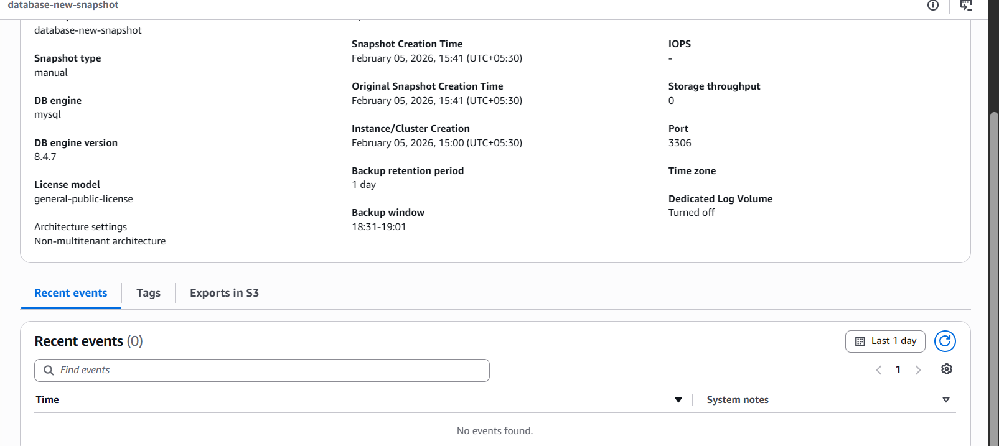
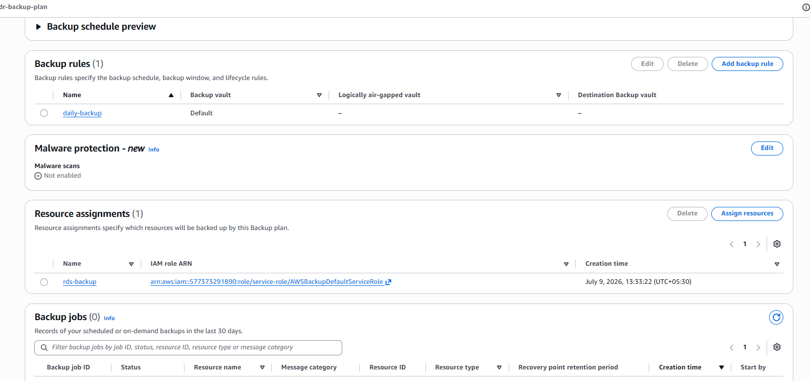
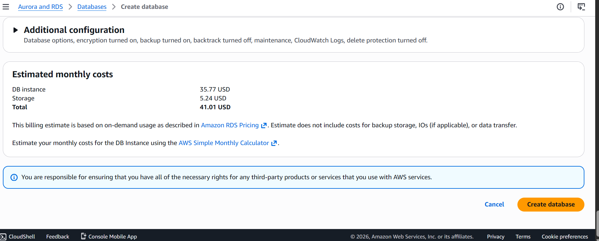

# AWS High Availability & Disaster Recovery Architecture

## 📌 Project Overview

This project demonstrates a production-style AWS infrastructure designed for **High Availability**, **Scalability**, and **Disaster Recovery** using AWS managed services.

The architecture distributes traffic across multiple Availability Zones, automatically scales application servers based on demand, ensures database redundancy using Amazon RDS Multi-AZ, and protects data with AWS Backup for fast recovery.

---

# 🏗️ Architecture

```
                           INTERNET
                               │
                               │
                      Internet Gateway
                               │
                               ▼
                 ┌─────────────────────────┐
                 │ Application Load Balancer│
                 └─────────────────────────┘
                         │
        ┌────────────────┴────────────────┐
        │                                 │
 Availability Zone A              Availability Zone B

 Public Subnet A                 Public Subnet B
        │                               │
        └──────────────┬────────────────┘
                       │
               Auto Scaling Group
                       │
        ┌──────────────┴──────────────┐
        │                             │
 Private App Subnet A         Private App Subnet B
        │                             │
     EC2 Instance 1              EC2 Instance 2
        │                             │
        └──────────────┬──────────────┘
                       │
                 Security Group
                       │
                       ▼

 Private DB Subnet A         Private DB Subnet B
        │                             │
        │                             │
   RDS Primary  ─────────────►  RDS Standby
      (AZ-A)                    (AZ-B)

               Automatic Multi-AZ Replication

                       │
                       ▼

                 AWS Backup Plan
                       │
               Daily Recovery Points
                       │
                  Backup Vault

                       │
                       ▼

               CloudWatch Monitoring
```

---

# 🚀 AWS Services Used

- Amazon VPC
- Internet Gateway
- NAT Gateway
- Elastic IP
- Public Subnets
- Private Application Subnets
- Private Database Subnets
- Route Tables
- Security Groups
- Amazon EC2
- Application Load Balancer (ALB)
- Launch Template
- Auto Scaling Group
- Amazon RDS (Multi-AZ)
- DB Subnet Group
- AWS Backup
- Backup Vault
- CloudWatch

---

# 🌐 Network Architecture

| Resource | CIDR |
|----------|---------|
| VPC | 10.0.0.0/16 |
| Public Subnet A | 10.0.1.0/24 |
| Public Subnet B | 10.0.2.0/24 |
| Private App Subnet A | 10.0.3.0/24 |
| Private App Subnet B | 10.0.4.0/24 |
| Private DB Subnet A | 10.0.5.0/24 |
| Private DB Subnet B | 10.0.6.0/24 |

---

# ⚙️ Implementation Steps

## Step 1 - Create VPC

Created a VPC with CIDR block:

```
10.0.0.0/16
```

---

## Step 2 - Create Networking

Created

- Internet Gateway
- NAT Gateway
- Elastic IP
- Public Route Table
- Private Route Table
- DB Route Table

Created Subnets

- Public Subnet A
- Public Subnet B
- Private App Subnet A
- Private App Subnet B
- Private DB Subnet A
- Private DB Subnet B

---

## Step 3 - Deploy EC2

Created Ubuntu EC2 Instance.

Installed Apache using User Data.

Configured Security Groups.

---

## Step 4 - Configure Load Balancer

- Created Target Group
- Registered EC2
- Created Application Load Balancer
- Configured Health Checks

---

## Step 5 - Configure Auto Scaling

Created Launch Template

Configured Auto Scaling Group

- Minimum Capacity = 2
- Desired Capacity = 2
- Maximum Capacity = 4

Configured Target Tracking Policy

CPU Utilization = 50%

---

## Step 6 - Configure Amazon RDS

Created Amazon RDS Database

- MySQL Engine
- Multi-AZ Deployment
- Private DB Subnets
- DB Subnet Group
- Automated Backups Enabled

---

## Step 7 - Configure AWS Backup

Created

- Backup Plan
- Backup Rule
- Backup Assignment
- Backup Vault

Daily recovery points are created automatically.

---

# 🔄 Workflow

1. User sends request.

2. Request reaches Internet Gateway.

3. Internet Gateway forwards traffic to Application Load Balancer.

4. ALB distributes traffic across EC2 instances.

5. Auto Scaling launches additional EC2 instances when CPU utilization increases.

6. EC2 communicates with Amazon RDS.

7. RDS automatically replicates data to the standby database in another Availability Zone.

8. AWS Backup creates scheduled recovery points.

9. If the primary database fails, RDS performs automatic failover.

10. If data is deleted or corrupted, AWS Backup restores the database.

---

# 🛡️ High Availability Features

- Multi-AZ Architecture
- Application Load Balancer
- Auto Scaling
- Health Checks
- Multi-AZ Amazon RDS
- Automatic Database Failover

---

# 💾 Disaster Recovery Features

- AWS Backup
- Backup Vault
- Daily Recovery Points
- Backup Assignment
- Automated Backup
- Database Restore
- Business Continuity

---

# 📷 Screenshots

## VPC


---

## Application Load Balancer


---

## Auto Scaling Group


---

## EC2 Health Check


---

## CloudWatch Monitoring


---

## Amazon RDS



---

## AWS Backup Plan



---

## Estimated Cost



---

# 📈 Results

- High Availability achieved across multiple Availability Zones.
- Automatic Load Distribution using ALB.
- Automatic EC2 Scaling.
- Database Redundancy using Amazon RDS Multi-AZ.
- Automatic Backup using AWS Backup.
- Improved Disaster Recovery.
- Reduced Downtime.
- Production-style AWS Infrastructure.

---

# 📚 Key Learnings

- AWS VPC Design
- Public & Private Networking
- Route Tables
- NAT Gateway
- Internet Gateway
- Security Groups
- EC2
- Load Balancer
- Auto Scaling
- Amazon RDS
- Multi-AZ Architecture
- AWS Backup
- Disaster Recovery
- CloudWatch Monitoring
- AWS Best Practices

---

# ✅ Conclusion

This project demonstrates how to build a scalable, highly available, and disaster-resilient AWS infrastructure using industry best practices. By combining Auto Scaling, Application Load Balancer, Amazon RDS Multi-AZ, and AWS Backup, the architecture ensures high availability, automatic failover, reliable backups, and business continuity.

---

# 👩‍💻 Author

**Sapna Kumari**

AWS Cloud & DevOps Engineer

GitHub: https://github.com/sapnacloudengineer
